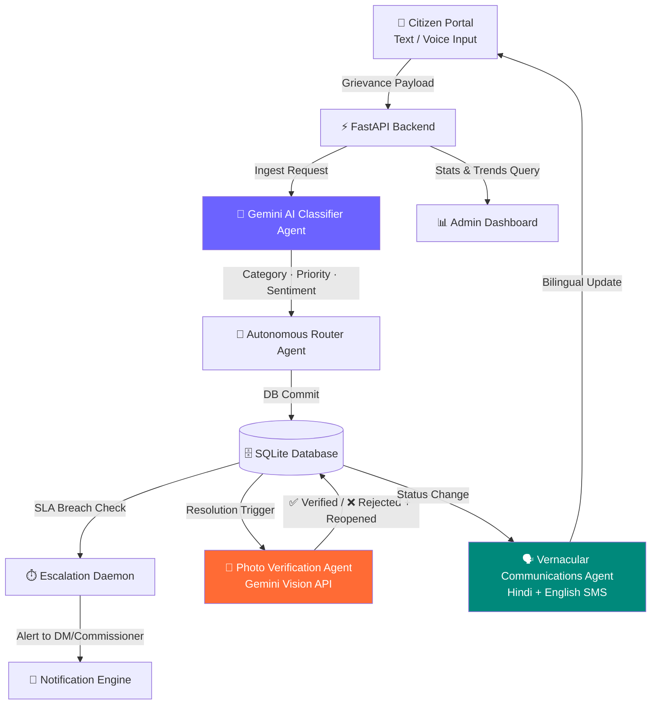

<div align="center">

# 🏛️ Jansathi AI

### AI-Powered Grievance Resolution Assistant for Smarter Governance
**Turning citizen complaints into verified resolutions — at the speed of AI.**

[](https://github.com)


**[🚀 Live Demo](#-demo-walkthrough) · [⚙️ Setup](#-setup--installation) · [🗺️ Roadmap](#-future-roadmap) · [👥 Team](#-team)**

</div>

---

## 🇮🇳 The Problem We're Solving

Government grievance portals like Uttar Pradesh's **Jansunwai** receive **millions of complaints annually**. Yet resolution consistently collapses under:

| Pain Point | Reality |
|---|---|
| 🐌 **Manual triaging** | Officers spend hours reading and sorting complaints |
| 🔀 **Wrong department routing** | Tickets bounce between departments for weeks |
| 🌑 **Zero transparency** | Citizens file a complaint and hear nothing back |
| 🗣️ **Language barriers** | Portals are English-first; citizens speak Bhojpuri, Awadhi, Braj |
| 🎭 **Fake closures** | Officials mark tickets "Resolved" without doing any actual work |

**Jansathi AI closes every one of these gaps** with an end-to-end agentic pipeline powered by generative AI.

---

## ✨ Feature Highlights

<table>
<tr>
<td width="50%">

**🤖 AI Grievance Ingestion**
Instantly detects intent, extracts keywords, and estimates category & sentiment from free-form citizen text or voice input.

</td>
<td width="50%">

**🎙️ Speech-to-Text Dictation**
Native voice input in Hindi and English — no keyboard required. Built for Bharat's next billion users.

</td>
</tr>
<tr>
<td>

**📬 Intelligent Auto-Routing**
Complaints are automatically assigned to the right department — PWD, UPPCL, Sanitation, Health — with SLA priority levels.

</td>
<td>

**⏱️ Autonomous SLA Escalation**
A daemon scheduler watches every ticket. When an SLA is breached, it auto-escalates to the DM/Commissioner without any human trigger.

</td>
</tr>
<tr>
<td>

**📲 Vernacular SMS Notifications**
Citizens receive bilingual updates in conversational Hindi + English at every stage of their grievance journey.

</td>
<td>

**📊 Command Analytics Dashboard**
Admin oversight portal with SVG trend charts, workload distribution heatmaps, and real-time resolution statistics.

</td>
</tr>
</table>

---

## 📸 Photo-Verified Resolution with AI Tamper Detection

> ⭐ **The strongest AI demo in Jansathi — and the most important governance primitive we've built.**

The single biggest loophole in real-world grievance systems is **fake closures** — officials marking tickets "Resolved" without doing any actual work. Jansathi AI closes it permanently.

Before an official can mark a ticket Resolved, they must upload a **"work done" photo**. Gemini Vision then cross-checks the photo against the original complaint description and issues a structured verdict:

```
Complaint:  "Massive potholes on main crossing road near Hazratganj"
Photo:      [office desk]         →  ❌ REJECTED — Ticket re-opened, mismatch flagged
Photo:      [freshly filled road] →  ✅ APPROVED — Resolution confirmed, ticket closed
```

The AI acts as an **impartial, incorruptible verifier**. During the demo — try to cheat it. Watch it catch you.

---

## 🛠️ Tech Stack

### Core Infrastructure

| Layer | Technology |
|---|---|
| **Frontend** | React (Vite) + Tailwind CSS + Lucide Icons |
| **Backend** | FastAPI (Python) |
| **Database** | SQLite with SQLAlchemy ORM |

### AI & Intelligence

| Tool | Role in Jansathi AI |
|---|---|
| **Google Gemini 1.5 Flash** | Core classification agent — intent detection, category tagging, priority scoring, sentiment analysis |
| **Gemini Vision API** | Photo-verified resolution engine — cross-checks "work done" photos against complaint descriptions, returns structured JSON verdicts |
| **Claude (Anthropic)** | Reasoning backbone for escalation logic, vernacular SMS drafting, and high-stakes classification edge cases requiring nuanced language understanding |
| **Heuristic Fallback Engine** | Local keyword-based classifier — activates automatically when no API key is present, keeping the full pipeline operational for offline demos |

---

## ⚙️ Architecture



---

## 📁 Project Structure

```
Jansunwai_Ai_Portal-main/
├── backend/
│   ├── agents/
│   │   ├── classifier.py          # Gemini AI classification agent
│   │   ├── escalator.py           # SLA breach & escalation daemon
│   │   ├── photo_verifier.py      # Gemini Vision tamper detection agent ⭐
│   │   ├── router.py              # Intelligent department routing
│   │   └── vernacular.py          # Bilingual SMS drafting agent
│   ├── main.py                    # FastAPI app + all API endpoints
│   ├── database.py                # SQLAlchemy models & seed data
│   ├── requirements.txt
│   └── .env                       # API keys (not committed)
│
└── frontend/
    ├── src/
    │   ├── components/
    │   │   └── PhotoVerifiedResolution.jsx   # AI tamper detection UI ⭐
    │   ├── pages/
    │   │   ├── AdminDashboard.jsx
    │   │   ├── ComplaintDetails.jsx
    │   │   ├── SubmitComplaint.jsx
    │   │   ├── TrackComplaint.jsx
    │   │   ├── Analytics.jsx
    │   │   └── Login.jsx
    │   └── services/
    │       └── api.js             # All frontend API calls
    ├── index.html
    └── package.json
```

---

## 🚀 Setup & Installation

### Prerequisites


---

### 1. 🐍 Backend Setup

```bash
cd backend
```

Create and activate a virtual environment:

```bash
# Windows
python -m venv venv
venv\Scripts\activate

# macOS / Linux
python3 -m venv venv
source venv/bin/activate
```

Install dependencies:

```bash
pip install -r requirements.txt
```

Configure your API keys — create a `.env` file inside `backend/`:

```env
GEMINI_API_KEY=your_gemini_api_key_here
ANTHROPIC_API_KEY=your_anthropic_api_key_here
```

> 💡 **No API key? No problem.** Jansathi AI automatically activates a local keyword-based heuristic fallback, keeping classification, priority detection, and routing fully operational for offline testing.

Start the backend server:

```bash
python main.py
```

**Backend live at → `http://127.0.0.1:8000`**

---

### 2. ⚛️ Frontend Setup

```bash
cd frontend
npm install
npm run dev
```

**Dashboard live at → `http://localhost:5173`**

---

## 🎥 Demo Walkthrough

> From complaint to verified resolution in under 2 minutes.

**Step 1 — Ingestion**
A citizen dictates a complaint in Hindi:
> *"Sector 4 ke main crossing road par bade bade gaddhe ho gaye hain, do-wheeler gir rahe hain."*

**Step 2 — AI Analysis** *(< 1 second)*
Click **"File Official Grievance"** and watch the agents work:
```
Category   →  Roads
Department →  Public Works Department (PWD)
Priority   →  🔴 HIGH  (accident safety risk detected)
Ticket ID  →  TKT-XXXXXX
```

**Step 3 — Citizen Notification**
A vernacular SMS log is recorded instantly:

| Language | Message |
|---|---|
| 🇬🇧 English | *"Your complaint has been assigned to Public Works Department..."* |
| 🇮🇳 Hindi | *"आपकी शिकायत Public Works Department को सौंप दी गई है।"* |

**Step 4 — Admin SLA Escalation**
Switch to the **Admin Panel** → click **"Simulate 48h SLA Tick"**:
- All tickets are aged by the daemon
- High-priority tickets older than 3 days → **auto-escalated to District Commissioner**
- Bilingual warning notifications dispatched to citizen

**Step 5 — Resolution with Photo Verification** ⭐
The PWD admin uploads a photo of the repaired road and submits:
> *"Repaired road crossing potholes. Inspector verified."*

Gemini Vision analyses the photo:
- Photo matches pothole repair → ✅ **Status: Resolved**
- Photo shows unrelated content → ❌ **Ticket re-opened, official flagged**

---

## 🔮 Future Roadmap

| Feature | Description |
|---|---|
| 🗺️ **District Heatmaps** | Geotagged density maps of civic issues to assist district budget planning |
| 🤖 **WhatsApp Bot** | File and track complaints via interactive WhatsApp dialogue — zero app install needed |
| 🔍 **Duplicate Detection** | Vector database clustering to group similar complaints from multiple citizens |
| 🖼️ **Full OCR Pipeline** | Scan uploaded grievance documents and handwritten letters for automated intake |

---

## 👥 Team

<div align="center">

| Neeraj | Rounak | Vinay | Sreedharan |
|:---:|:---:|:---:|:---:|
| 🧑‍💻 | 🧑‍💻 | 🧑‍💻 | 🧑‍💻 |

**Team Boolean** · Built for the *Build with AI: Agentic Premier League* Hackathon

</div>

---

## 📄 License

This project was built for the Build with AI: Agentic Premier League Hackathon. See `LICENSE` for details.

---

<div align="center">

**जनसाथी — साथ है जनता के।**
*Jansathi — Always with the people.*


</div>
